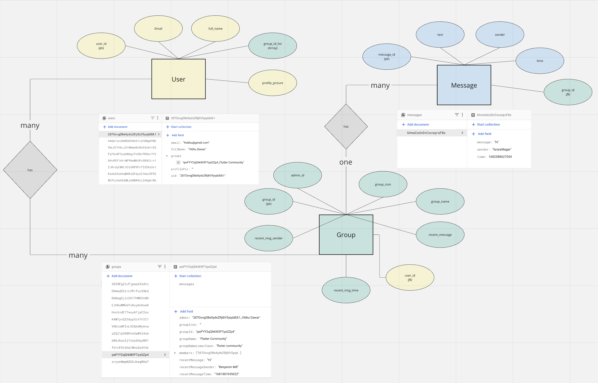

<p align="center">
  
</p>


# Groupie: Chat app with Firebase

Welcome to Groupie, the chat app that revolutionize the way you connect with people. With Groupie, you can create or join communities of like-minded individuals from all over the world, and chat with your friends and family without any boundaries.

Groupie allows you to make as many communities as you want and search for other communities to join. Whether you are passionate about cooking, photography, or travel, you can find the perfect community for you. You can also invite your friends and family to join your community, and share your interests with them.

Groupie is a simple, yet powerful app that provides a smooth and user-friendly experience. With our app, you can easily send messages and stay connected with your loved ones. We offer a wide range of features that allow you to customize your profile, manage your communities, and much more.

How does it work?
- Register/Login the app using your email, and password.
- Either join any of the existing communities from the search section, or make a new one yourself. Encourage your friends to join your community.
- Chat with your friends and other members in the community without any barriers.

Groupie is the perfect chat app for anyone who wants to connect with people who share their interests and passions. Download Groupie today and start exploring the world of like-minded individuals!


## Screenshots

<table>
  <tr>
    <td></td>
    <td></td>
    <td></td>
    <td></td>
  </tr>
</table>


## Database Structure
<p align="center">
  
</p>


## Tech Stack

**Frontend:** Flutter

**Backend:** Firebase


## Run Locally
Make sure, flutter is installed in your machine. If not, then follow this: [INSTALLATION GUIDE](https://docs.flutter.dev/get-started/install). After that, follow the below steps:

Clone the project

```bash
  git clone https://github.com/vibhudawar/flutter-app-firebase.git
```

Go to the project directory

```bash
  cd chat_app
```

Install dependencies

```bash
  flutter pub get
```
Then run the project from through **RUN WITHOUT DEBUGGING**, in your emulator


## Google Playstore Link
[LINK](https://play.google.com/store/apps/details?id=com.phoenix.groupie)
## License

[MIT](https://choosealicense.com/licenses/mit/)

